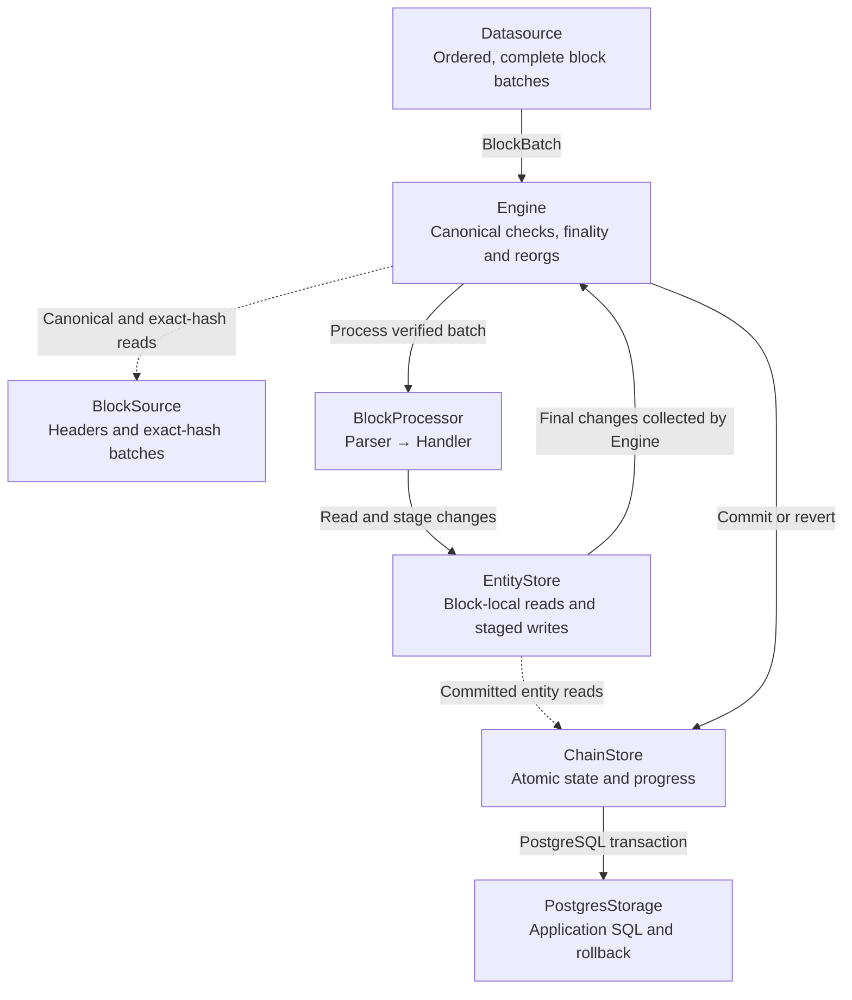

# Concepts

## Processing flow

The engine verifies each block, runs application work and coordinates its commit.

## Blocks, batches, and updates

`BlockBatch` contains one header and its selected updates, including an empty
update list when nothing matches. EVM parsers return:

| Input | Output | Required metadata |
| --- | --- | --- |
| `Update::Block(Box<Block>)` | `ParsedBlock<Block>` | Block number and hash |
| `Update::Log(LogUpdate)` | `ParsedLog<E>` | Block number/hash, transaction hash/index, log index and emitter |

`LogUpdate::parsed(value)` attaches the same metadata to custom decoded values.

## Data completeness and ordering

**Complete, ordered processing is required for correct application state.**
Completeness is relative to the configured source requirements, which must cover
the mapping. The committed pointer identifies a continuously processed branch
from the configured start.

1. Apply consecutive, parent-linked blocks in increasing height, including empty blocks. Recover gaps before advancing.
2. Within an EVM batch, process the selected block update first, then unique logs by global `log_index`. Transaction indices must agree with this order.
3. For each update, visit parsers in registration order and handlers in declaration order. Finish it before moving to the next update.
4. Publish state and progress together only after the whole block succeeds.

ERC20 balances require every relevant Transfer from the chosen initial state.
At block 98, suppose a balance is 100:

| Processed block | Change | Balance |
| --- | ---: | ---: |
| 99 | -5 | 95 |
| 100 | +30 | 125 |
| 101 | -15 | 110 |
| 102 | +40 | 150 |

After block 100 commits, 125 is the complete balance **at block 100**. Reaching
150 requires processing 101 and 102. Query state at the committed pointer, which
can lag the source head or move backward during recovery.

## Parser, handler, and processor

Parsers synchronously select and decode updates: a non-match returns no value;
malformed matching input fails the block. Sources and handlers own async I/O.
Handlers must produce repeatable state and avoid external side effects:
they run before the write transaction and may execute again during recovery.

## Block-local state and atomic commit

Each block gets fresh in-memory entity state. Reads lazily load committed values;
later handlers see earlier staged changes. Parser, handler or read failures
discard the block. The store validates the expected pointer and commits final
entity changes, the canonical header and progress in one transaction.

## Canonical chain and reorganization

At startup and while streaming, Raven checks its committed branch against the
source. Before recovery it cancels and joins the producer and discards its queue.

The engine prepares exact-hash replacement batches back to the common ancestor,
validates the rollback path and rechecks the branch before mutation. Preparation
failure leaves state unchanged. It reverts old blocks in decreasing height, then
applies complete eligible replacements in increasing height using normal update
and handler order.

**Recovery must equal a clean replay** through the same block hash, with the same
mapping, acquisition requirements and initial state. Application `revert_block`
restores business state; Raven restores canonical metadata and progress.

Each transition is atomic; the whole recovery is not one transaction. Failures
leave the last committed position, and readers may observe intermediate heights.
The application owns query consistency. Reverting the first indexed block retains
network metadata; a fork crossing the configured start fails and requires rebuilding.

## Finality and cancellation

`Head` permits the observed head; `Confirmations(n)` requires `n` successors.
Both use canonical checks and reorg recovery.

Cancellation joins the producer and discards queued batches. Sources must make
acquisition and blocked sends cancellable, and cancel or abort child tasks when
`consume` is dropped. Acquisition failures must never become empty batches.
