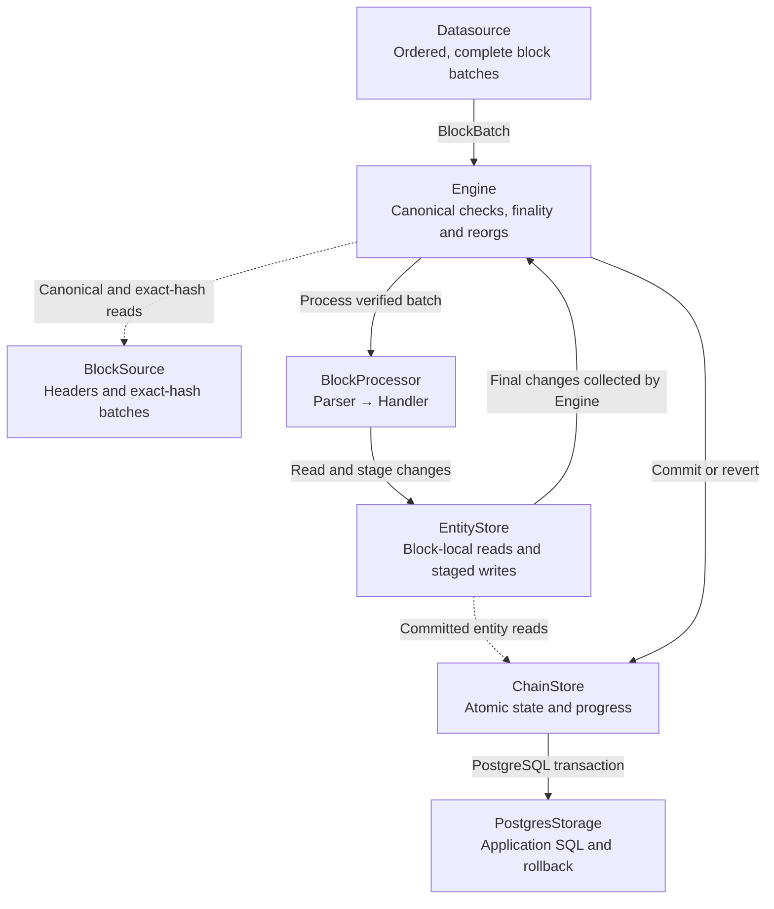

# Concepts

## Processing flow

`Pipeline` connects acquisition, canonical processing, application handlers, and storage. The engine coordinates each block's processing and commit.

1. **Acquire.** `Datasource` emits complete, ordered `BlockBatch` values under its configured acquisition filter. `BlockSource` provides headers and exact-hash batches for canonical verification and recovery. See [Acquisition filters and parser matching](datasources.md#acquisition-filters-and-parser-matching) for filter ownership.
2. **Verify and process.** `Engine` checks canonical identity, continuity, and finality eligibility. The pipeline's `BlockProcessor` visits updates in source order, invokes parsers in registration order, and runs each parser's handlers in their declared order.
3. **Stage.** Handlers read and write through `EntityStore`. Its block-local implementation keeps pending changes in memory, so later handlers observe earlier changes. It lazily reads committed entities through `ChainStore`.
4. **Commit or recover.** After processing succeeds, `Engine` collects the final `EntityChange` values and calls `ChainStore::commit_block`. The store commits application state, the canonical header, and progress together. During reorg recovery, the engine calls `ChainStore::revert_block` before processing eligible replacements.

With PostgreSQL, `PostgresChainStore` supplies the transaction and calls the application's `PostgresStorage` implementation for entity reads, SQL writes, and rollback. Handlers stage changes; the engine and store coordinate their publication. See [Storage](storage.md) for the application storage contract.

## Blocks, batches, and updates

A datasource produces complete `BlockBatch` values in increasing block order. A batch has a header and its selected block and log updates. Empty blocks are still batches: they advance canonical progress and must not be silently omitted.

EVM updates are `Update::Block(Box<Block>)` for full block payloads or `Update::Log(LogUpdate)` for mined logs. `BlockParser` wraps the block payload with its chain position; `LogParser` decodes a matching ABI event.

The engine checks branch identity and adjacency before an apply. It does not invent missing source payloads; a datasource is responsible for making configured payload complete, correctly ordered, unique, and tied to the batch header.

## Parser, handler, and processor

An EVM `Parser` synchronously selects and decodes an update in memory into a typed value or says it does not match. Source acquisition and handlers own asynchronous I/O. Handlers registered for that parser run in declaration order. Pipeline assembly combines registered parsers and handlers into the engine's block processor.

Handlers are application code. They should derive state from parsed data and the block-local entity store. They run before the write transaction, so do not publish external side effects: a handler can be retried after a failed commit or a reorganization.

## Block-local state and atomic commit

For each block Raven creates a fresh entity state. Reads lazily obtain committed application state and writes remain in memory. A later event or handler in the same block observes an earlier `save` or `remove`.

If parsing, handling, or a state read fails, Raven discards the whole pending state. If processing succeeds, the store validates the expected committed block pointer, applies application changes, records the canonical header and moves progress in one transaction. A crash or cancellation before commit leaves the block unapplied.

## Canonical chain and reorganization

The stored block pointer names the last applied canonical header. At startup and while streaming, Raven compares that history to the source. On a divergent branch it stops the producer, finds a common ancestor, invokes `revert_block` for each current head being removed, then applies eligible replacement blocks.

`revert_block` is application work. Raven restores its own canonical metadata and pointer, but only the application knows how to restore balances, relations, aggregates, or native SQL row versions.

The engine preserves network metadata when the first indexed block is reverted. If a fork crosses the configured start boundary, it fails rather than guessing what pre-start state should have been.

## Finality and cancellation

`FinalityPolicy::Head` permits observed head blocks. `Confirmations(n)` permits only blocks with at least `n` successors under the observed head. Both modes use the same canonical checks and reorg path.

Cancellation stops the active datasource producer, joins it, and discards queued batches. It does not turn unavailable data into an empty block. Datasource implementations must make blocked acquisition and channel sends responsive to the cancellation token.

A datasource must also own any tasks it spawns: dropping its `consume` future must cancel or abort those tasks. The Uniswap example uses a child cancellation guard and `JoinSet` for its nested pool producer.