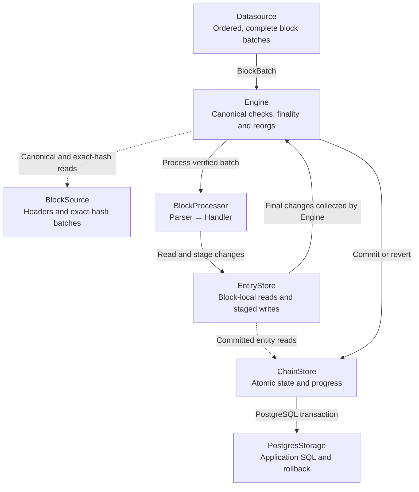

# Concepts

## Processing flow

`Pipeline` connects acquisition, canonical processing, application handlers, and storage. The engine coordinates each block's processing and commit.

1. **Acquire.** `Datasource` emits complete, ordered `BlockBatch` values under its configured acquisition filter. `BlockSource` provides headers and exact-hash batches for canonical verification and recovery. See [Acquisition filters and parser matching](datasources.md#acquisition-filters-and-parser-matching) for filter ownership.
2. **Verify and process.** `Engine` checks canonical identity, continuity, and finality eligibility. The pipeline's `BlockProcessor` visits updates in source order, invokes parsers in registration order, and runs each parser's handlers in their declared order.
3. **Stage.** Handlers read and write through `EntityStore`. Its block-local implementation keeps pending changes in memory, so later handlers observe earlier changes. It lazily reads committed entities through `ChainStore`.
4. **Commit or recover.** After processing succeeds, `Engine` collects the final `EntityChange` values and calls `ChainStore::commit_block`. The store commits application state, the canonical header, and progress together. During reorg recovery, the engine calls `ChainStore::revert_block` before processing eligible replacements.

With PostgreSQL, `PostgresChainStore` supplies the transaction and calls the application's `PostgresStorage` implementation for entity reads, SQL writes, and rollback. Handlers stage changes; the engine and store coordinate their publication. See [Storage](storage.md) for the application storage contract.

## Blocks, batches, and updates

A datasource produces complete `BlockBatch` values in increasing block order. A batch has a header and its selected block and log updates. Empty blocks are still batches: they advance canonical progress and must not be silently omitted.

EVM updates are `Update::Block(Box<Block>)` for full block payloads or `Update::Log(LogUpdate)` for mined logs. `BlockParser` wraps the block payload with its chain position; `LogParser` decodes a matching ABI event.

The engine checks branch identity and adjacency before an apply. It does not invent missing source payloads; a datasource is responsible for making configured payload complete, correctly ordered, unique, and tied to the batch header.

## Data completeness and ordering

**Completeness and ordering are correctness requirements for application state.** A committed block pointer represents a continuously processed branch from the configured start, with every selected update in each applied block fully processed. Completeness is relative to the source's configured acquisition requirements, which the application must choose to cover its mapping.

The processing order is:

1. **Blocks:** apply consecutive blocks in increasing height, with each block extending the previous block's hash. Empty blocks still participate in this sequence. A gap triggers recovery; later blocks cannot advance progress past an unprocessed block.
2. **Updates within a block:** the built-in EVM crawlers deliver a selected full-block update first, followed by unique selected logs in increasing global `log_index` order. Transaction indices must agree with that log order. Custom sources must provide equivalent processing-ready ordering.
3. **Parsers and handlers:** for each update, visit parsers in registration order and run each matching parser's handlers sequentially in declaration order. Finish that update before processing the next one. Later handlers and updates observe earlier staged entity changes.
4. **Commit:** publish the block's final application changes and progress together only after all its updates have been processed successfully. A failed block cannot publish a subset of its staged changes or advance its pointer.

For example, an ERC20 mapping derives balances from the complete ordered `Transfer` history. Omitting a matching transfer or skipping an intermediate block can produce incorrect balances even if later events are decoded correctly. The mapping also needs a start block that includes its required history, or an explicitly bootstrapped initial state.

Suppose an account has balance `100` at block `98`, followed by these net changes on the selected branch:

| Fully processed block | Net balance change | Balance at that block |
| --- | ---: | ---: |
| 99 | -5 | 95 |
| 100 | +30 | 125 |
| 101 | -15 | 110 |
| 102 | +40 | 150 |

After block `100` commits, `125` is the complete balance at block `100`. It is not the balance at block `102`; processing must continue through blocks `101` and `102` to derive `150`. Consumers must interpret application state at the committed block pointer, which may lag the source head or move backward during rollback.

## Parser, handler, and processor

An EVM `Parser` synchronously selects and decodes an update in memory into a typed value or says it does not match. Source acquisition and handlers own asynchronous I/O. Handlers registered for that parser run in declaration order. Pipeline assembly combines registered parsers and handlers into the engine's block processor.

Handlers are application code. They should derive state from parsed data and the block-local entity store. They run before the write transaction, so do not publish external side effects: a handler can be retried after a failed commit or a reorganization.

## Block-local state and atomic commit

For each block Raven creates a fresh entity state. Reads lazily obtain committed application state and writes remain in memory. A later event or handler in the same block observes an earlier `save` or `remove`.

If parsing, handling, or a state read fails, Raven discards the whole pending state. If processing succeeds, the store validates the expected committed block pointer, applies application changes, records the canonical header and moves progress in one transaction. A crash or cancellation before commit leaves the block unapplied.

## Canonical chain and reorganization

The stored block pointer names the last applied canonical header. At startup and while streaming, Raven compares that history to the source. On a divergent branch it stops and joins the producer and discards its queued batches before recovery, so stale updates cannot enter the replacement stream.

The engine prepares exact-hash replacement batches back to the common ancestor, validates the local rollback path, and rechecks the observed branch before the first mutation. Missing or invalid source payloads detected during preparation leave local state unchanged. It then reverts old blocks in decreasing height and applies the complete eligible replacement sequence in increasing height, preserving the same per-block update and handler order as normal ingestion.

`revert_block` is application work. Raven restores its own canonical metadata and pointer, but only the application knows how to restore balances, relations, aggregates, or native SQL row versions.

**Recovery must preserve replay equivalence:** with the same mapping, acquisition requirements, and initial state, the recovered projection at a given block hash must match a clean replay of that branch through the same block. Restoring balances, relations, aggregates, and immutable events is part of this application contract.

Each revert or apply commits application state and progress atomically; the entire recovery is not one transaction. A failure during execution leaves the last successfully committed position for the next recovery attempt. Readers can observe intermediate committed heights and must use their application's query-consistency policy.

The engine preserves network metadata when the first indexed block is reverted. If a fork crosses the configured start boundary, it fails rather than guessing what pre-start state should have been.

## Finality and cancellation

`FinalityPolicy::Head` permits observed head blocks. `Confirmations(n)` permits only blocks with at least `n` successors under the observed head. Both modes use the same canonical checks and reorg path.

Cancellation stops the active datasource producer, joins it, and discards queued batches. It does not turn unavailable data into an empty block. Datasource implementations must make blocked acquisition and channel sends responsive to the cancellation token.

A datasource must also own any tasks it spawns: dropping its `consume` future must cancel or abort those tasks. The Uniswap example uses a child cancellation guard and `JoinSet` for its nested pool producer.
